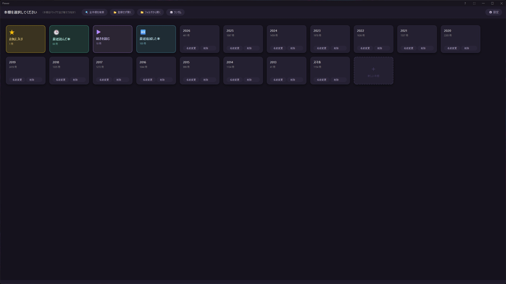
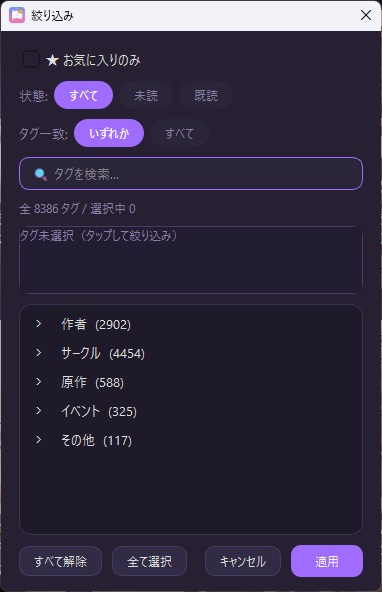
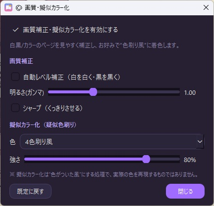

<div align="center">


# Piewer

**Windows 向け ローカル漫画ビュワー（完全無料・オープンソース）**

登録数無制限・本棚スクロール位置の記憶・PDF対応・縦読み対応など、<br>
快適に漫画を読むための機能を詰め込んだビュワーです。

[](https://github.com/p-almighty/Piewer/releases/latest)
&nbsp;
[-ff5e9a?style=for-the-badge)](https://ko-fi.com/p_almighty)
<br>


</div>

---

## ⬇️ ダウンロード

単体で動作します（Windows 10 / 11）。**すべての機能を無料で、登録数の制限なくお使いいただけます。**

### ⬇️ [**ダウンロード（GitHub Releases）→**](https://github.com/p-almighty/Piewer/releases/latest)

- `Piewer_Setup.exe` … インストール版（スタートメニュー登録・アンインストーラ付き）
- `Piewer.exe` … 非インストール版（ポータブル。置くだけで起動）

> 💗 Piewer は完全無料です。もし気に入っていただけたら、[**Ko-fi で開発を支援**](https://ko-fi.com/p_almighty)していただけると、今後の開発の励みになります（任意）。

---

## 📸 スクリーンショット

<div align="center">

**本棚を選ぶ**



**漫画を読む（見開き・縦読み・PDF 対応）**


**設定 ／ タグで絞り込み ／ 画質補正・擬似カラー化**

 &nbsp;  &nbsp; 

</div>

---

## ✨ 主な機能

- 📚 **複数の本棚** — ジャンル別などで本棚を分けて管理。**並び順は本棚ごとに記憶**
- ⭐ **お気に入り / 🕒 最近読んだ本** — 専用の本棚で素早くアクセス
- 🏷️ **タグ付け & 絞り込み** — タグ・お気に入り・全棚横断検索で目的の本へ
- 🔖 **しおり** — 好きなページに目印、前後ジャンプも
- 🚀 **登録数無制限** — 数千冊でも快適な仮想スクロール
- 📖 **見開き / 単ページ / 縦読み（Webtoon）** — 作品に合わせて切替、設定は本ごとに記憶
- ↕️ **幅 / 高さフィット** & ズーム・パン
- 🖱️ **タッチ & ドラッグ操作** — スワイプ・慣性スクロール対応
- 📂 **多彩な形式** — ZIP / CBZ / **EPUB / KEPUB** / RAR / CBR / **PDF** / 画像フォルダ（動くGIF/WebP/APNGも再生）
- 🤖 **AI 白黒→カラー自動着色** — ワンクリックで必要な一式を自動セットアップ。着色はすべてローカル完結で画像はPCの外に出ません（GPU/CPU 選択可・保存先変更可）
- 🔍 **AI 超解像（高解像度化）** — 低解像度のページをローカルAI（Real-CUGAN）でくっきり拡大。表示より小さいページにだけ自動で適用（ローカル完結・GPU/CPU 選択可）
- 🎨 **画質補正 & 擬似カラー化** — 自動レベル補正・ガンマ・シャープ＋“色刷り風”の疑似カラー（セピア/青/暖色/寒色/4色刷り風/色刷り(紺×橙)）
- ⌨️ **ショートカットのカスタマイズ**
- 💾 **続きから再開** & **バックアップ / 復元**
- 🌙 **ダーク / ライトテーマ** & アクセント色の変更

---

## 🆕 更新履歴

### v1.90
- 🔍 **AI 超解像（高解像度化）を追加** — 低解像度のページをローカルAIでくっきり拡大。「🎨 画質」→「🔍 AI超解像の設定を開く…」→「▶ 自動でセットアップ」のワンボタンで準備でき、表示より小さいページにだけ自動で適用されます
- 🗂 **RAR 読み込みの不具合を修正** — 一部の RAR/CBR（圧縮・RAR5）が開けずサムネイルも出なかった問題を修正（展開ツールを同梱）
- 📚 **本棚ごとに並び順を記憶**（登録順／ファイル名／最近読んだ順／進捗順／シリーズ順）
- 🏷️ **タグ編集を改善** — 既存タグ名を入力するとそのタグを選択（重複作成を防止）＋最近つけたタグ5件を候補表示

### v1.81
- 🐛 **AI着色の不具合を修正** — 配布版（exe）で「AI着色」を開くと「着色プラグインが見つかりません」と表示され使えなかった問題を修正（着色プラグインに必要な標準ライブラリが exe に含まれていませんでした）。v1.80 でお試しいただけなかった方はこちらへ更新してください

### v1.80
- 🤖 **AI 白黒→カラー自動着色** — ⚙設定 →「🤖 AI着色」→「AI着色を自動で準備する」を押すだけで、必要な一式（実行用 Python・AIライブラリ・着色プログラム・モデル）を自動でダウンロード＆セットアップ。**着色はすべてローカルで完結**し、画像は PC の外に出ません（GPU / CPU を選択可・保存先は別ドライブにも変更可）
- 🎨 **擬似カラー化に「色刷り(紺×橙)」プリセットを追加**

### v1.72
- 📘 **KEPUB 対応** — Kobo の `.kepub` / `.kepub.epub`（画像ベース）を開けるように
- 🎨 **画質補正** — 自動レベル補正・ガンマ（明るさ）・シャープ
- 🎨 **擬似カラー化（疑似色刷り）** — セピア / 青(2色刷り) / 暖色 / 寒色 / 4色刷り風。HUDの「🎨 画質」または ⚙設定 から（“色がついた風”にする軽量処理で、AI着色とは別物です）
- ℹ️ Kindle の **KFX は非対応**。所有する本は [Calibre](https://calibre-ebook.com/)（無料・KFX Input プラグイン）で EPUB/CBZ に変換するとお使いいただけます

### v1.71
- 🏷️ **オートタグの分類名を自由に変更** — 作者 / サークル / 原作 / イベント等の分類名を、自分のファイル命名に合わせてリネームできるように（⚙設定 → タグの管理 → 分類名を編集）
- 🔎 **タグ絞り込みの自動グループ化** — 「分類名:値」形式の接頭辞を自動で見出しにまとめて表示
- 🛡️ **ウイルス対策ソフトの誤検知対策** — 実行ファイルにバージョン情報などのメタデータを付与し、圧縮方式を見直し（詳細は[こちら](#️-ウイルス対策ソフトの警告が出る場合)）

### v1.7
- 🆓 **完全無料化** — 登録数の制限を撤廃し、すべての機能を無料で開放
- 📖 **オープンソース化（MIT ライセンス）** — ソースコードを公開
- 💗 **Ko-fi での開発支援（寄付）** に対応

### v1.6
- 📘 **EPUB（画像ベース）に対応** — 動く GIF / WebP / APNG はページ内で自動再生
- ↔️ **綴じ方向（右/左）を自動判定**（EPUB）
- 🗂 **目次（全ページのサムネイル一覧）** からワンタップでジャンプ
- 🔍 **ズームをマウス位置中心に** — ホイール／上下ドラッグ（無段階）。中央ダブルクリックで等倍に戻す
- 📁 **「フォルダから開く」** — PC のフォルダをたどってその場で閲覧（登録不要）
- 🏷️ **ファイル名から自動タグ付け（実験的）** — 作者 / サークル / 原作 / イベントを抽出
- 🔎 **タグ絞り込みを刷新** — 種類別の折りたたみ表示＋タグ検索（ひらがな/カタカナ・全角/半角を区別しない）
- 💾 **本は既定で「続きから」**（⚙設定で変更可）
- ⚡ 連続ページめくりの高速化、本棚スクロールまわりの不具合修正 ほか

### v1.5
- 🪟 **Windows標準のウィンドウスナップに対応** — 画面端へドラッグして分割表示（スナップレイアウト）
- ⛶ **全画面まわりを改善** — マウスを画面最上部に寄せるとタイトルバーが出現。閲覧中の Esc は常に本棚へ戻る（全画面は維持）
- 🖱️ **マウスホイールでページ送り**に切替可能（⚙設定／閲覧中のメニュー。上で次・下で前）
- 📂 **「登録せずに開く」モード**を追加（本棚に入れずにそのまま閲覧）
- 🔍 **本棚一覧から全本棚を横断検索**するボタンを追加
- 🖱️ **本棚一覧へのドラッグ＆ドロップ** — 何もない所＝登録せず開く／本棚カード＝その本棚に登録
- 🔇 「続きから読む」確認ダイアログの効果音を解消、ほか細かな改善

### v1.4
- 🎨 **UIデザインを刷新** — バイオレットのアクセント＋しっかり丸いポップなデザイン（ピル型ボタン・角丸カード・ふんわり影）。本棚は ⭐お気に入り=金 / 🕒最近読んだ本=ティール で色分け

### v1.3
- 🔖 しおり、🏷️ タグ付け・お気に入り、🔍 全棚横断検索、📖 縦読み（Webtoon）、⌨️ ショートカット設定、💾 バックアップ/復元 ほか多数

### v1.2 / v1.1 / v1.0
- 履歴棚・D&D並び替え・ヘルプ・軽量化／カバーJPG化・高リフレッシュレート対応／初回リリース

---

## 📂 対応ファイル形式

`ZIP` / `CBZ` / `EPUB` / `KEPUB`(.kepub/.kepub.epub) / `RAR` / `CBR` / `PDF` / 画像フォルダ
（内包画像: JPG / PNG / GIF / BMP / WEBP。動く GIF / WebP / APNG は自動再生）

> Kindle の **KFX は非対応**です。所有する本は [Calibre](https://calibre-ebook.com/)（無料・KFX Input プラグイン）で EPUB/CBZ に変換してお開きください。

---

## ⌨️ 操作方法（抜粋）

| 操作 | 動作 |
|------|------|
| 画面 左/右クリック | ページを進む / 戻る |
| ドラッグ / スワイプ | ページめくり |
| 画面 中央クリック・右クリック | メニュー(HUD)表示 |
| ホイール | ズーム（縦読み中はページ送り） |
| `[` / `]` | 次 / 前のしおりへ |
| F11 | 全画面切り替え |
| Esc | 全画面解除 / 本棚に戻る |

詳しい使い方・全ショートカットは同梱の `readme.txt`、またはアプリ右上の「?」ヘルプをご覧ください。

---

## 🛠️ ソースからの実行・ビルド

```sh
pip install PySide6 Pillow rarfile PyMuPDF
python manga_viewer.py
```

exe 化（任意）:

```sh
pip install pyinstaller
python -m PyInstaller Piewer.spec --noconfirm --clean
```

| ライブラリ | 用途 | 任意/必須 |
|-----------|------|----------|
| PySide6 | GUI全般 | 必須 |
| Pillow | 画像読込・リサイズ | 必須 |
| PyMuPDF (fitz) | PDF対応 | 任意 |
| rarfile | CBR/RAR対応 | 任意 |

---

## 💻 動作環境

- Windows 10 / 11（64bit）
- 配布版（exe）は Python のインストール不要

---

## ⚠️ ウイルス対策ソフトの警告が出る場合

ダウンロード時や初回起動時に、Windows Defender や一部のウイルス対策ソフトが警告を表示することがあります。これは **誤検知（false positive）** です。

- Piewer は **Python + PyInstaller** で1つの exe にまとめています。この形式は、中身が安全でも「見慣れないプログラム」としてヒューリスティック判定で警告されやすいことが知られています。
- Piewer は **完全オープンソース（MIT）** です。ソースコードはすべてこのリポジトリで公開しており、不審な処理は含まれていません。心配な場合はソースから自分でビルドして実行できます（[ソースからの実行・ビルド](#️-ソースからの実行ビルド)）。
- exe を [VirusTotal](https://www.virustotal.com/) にアップロードすると、複数のエンジンで確認できます（多くのエンジンが「安全」と判定し、一部のみが誤検知します）。

### 起動するには

- **Windows SmartScreen**（「WindowsによってPCが保護されました」）→ **［詳細情報］→［実行］** をクリック。
- **ウイルス対策ソフトが削除/隔離する場合** → 「検疫/隔離」から復元し、Piewer.exe を **例外（許可リスト）** に追加してください。

### Microsoft に誤検知を報告する（任意・改善に役立ちます）

Windows Defender が誤検知した場合、[Microsoft Security Intelligence の誤検知報告フォーム](https://www.microsoft.com/en-us/wdsi/filesubmission) から「ソフトウェア開発者」として提出すると、後日 Microsoft 側の定義が更新され警告が出なくなることがあります。

> 将来的には、誤検知を根本的に減らすための **コード署名証明書** の導入も検討しています。

---

## 📜 ライセンス

**MIT License** — 改変・再配布・商用利用も自由です。詳細は [LICENSE.txt](LICENSE.txt) をご確認ください。

`Copyright (c) 2026 P (p-almighty)`

---

## 👤 制作者

**P**
X (Twitter): [@p_almighty](https://x.com/p_almighty)

💗 [Ko-fi で開発を支援する](https://ko-fi.com/p_almighty)

---

<div align="center">
<sub>Piewer — Manga Viewer for Windows ・ MIT License ・ (c) 2026 P</sub>
</div>
